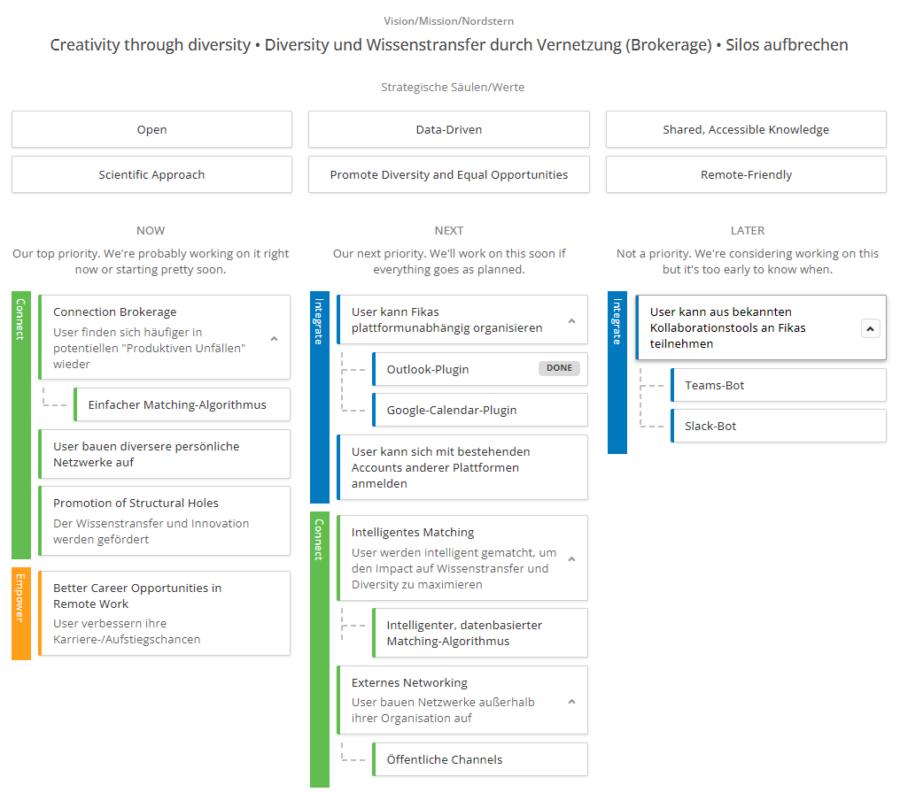
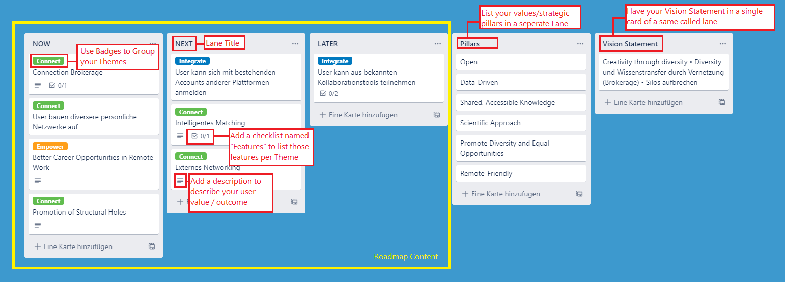
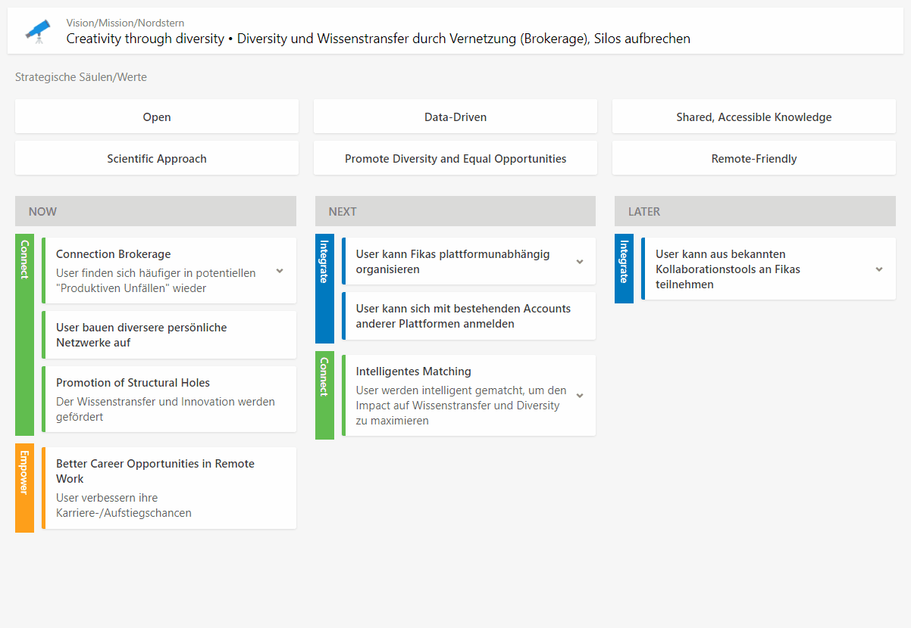

# Theme-Based Roadmap using Trello as the Backend

This is a simple theme-based roadmap using Trello as the backend. This means that you can manage your roadmap content using the simple, well-known interface of Trello boards while having a well-formatted, readonly roadmap for your presentations or to embbed on your website to provide transparency for your users.



## Getting Started

### Installation

Install the dependencies:

```bash
yarn install
```

Set the environment variables:

```bash
cp .env.example .env
```

ℹ Open .env and set your trello credentials, board id, and preferenced style theme in the environment variables.

#### How do I get the id of my board?

Simply put `.json` at the end of your board's URL. In the displayed json, the board id waits for you at the very start of the document.

#### How to get credential for Trello?

The most simply way to retrieve your credentials is to open https://trello.com/app-key. You will retrieve your personal API Key there (it is bound to your account, so it may be a good option to create and invite a custom technical user account to your roadmap board).

Once you received your API key, use it to open this URL https://trello.com/1/authorize?expiration=never&scope=read&response_type=token&name=Server%20Token&key=<YOUR_API_KEY_HERE> to retrieve a OAuth token for read only access to your board.

#### How is the content to be organized on the Trello board?

Simply organize your board as in the following picture. Take care to name your lanes as shown to be displayed correctly in the roadmap.



See how changes take effect:



### Commands

Running locally:

```bash
yarn dev
```

The default port is 3000, so check `http://localhost:3000/` or what your server is after startup.

Running in production:

```bash
yarn start
```

Docker:

```bash
# run docker container in development mode
yarn docker:dev

# run docker container in production mode
yarn docker:prod
```

The default port is 3000, so check `http://localhost:3000/` or what your server is after startup.

## Changelog

#### Upcoming

- You can specify startup params (Trello credentials and board id) on Docker startup.
- There is a public Docker container available.

#### 2021-10-11

- You can use a Trello board to be rendered as the roadmap by specifying .env params.
- Runnable in Docker

## Project Structure

> ℹ The following is only interesting for you if you are looking forward to modify things. The project is based on a fork of https://github.com/hagopj13/node-express-boilerplate.

```
src\
 |--config\         # Environment variables and configuration related things
 |--controllers\    # Route controllers (controller layer)
 |--middlewares\    # Custom express middlewares
 |--routes\         # Routes
 |--services\       # Business logic (service layer)
 |--utils\          # Utility classes and functions
 |--app.js          # Express app
 |--index.js        # App entry point
```

## Features of underlying Boilerplate

- **ES9**: latest ECMAScript features
- **Logging**: using [winston](https://github.com/winstonjs/winston) and [morgan](https://github.com/expressjs/morgan)
- **Error handling**: centralized error handling mechanism
- **Process management**: advanced production process management using [PM2](https://pm2.keymetrics.io)
- **Dependency management**: with [Yarn](https://yarnpkg.com)
- **Environment variables**: using [dotenv](https://github.com/motdotla/dotenv) and [cross-env](https://github.com/kentcdodds/cross-env#readme)
- **Security**: set security HTTP headers using [helmet](https://helmetjs.github.io)
- **Santizing**: sanitize request data against xss and query injection
- **CORS**: Cross-Origin Resource-Sharing enabled using [cors](https://github.com/expressjs/cors)
- **Compression**: gzip compression with [compression](https://github.com/expressjs/compression)
- **CI**: continuous integration with [Travis CI](https://travis-ci.org)
- **Docker support**
- **Code coverage**: using [coveralls](https://coveralls.io)
- **Code quality**: with [Codacy](https://www.codacy.com)
- **Linting**: with [ESLint](https://eslint.org) and [Prettier](https://prettier.io)
- **Editor config**: consistent editor configuration using [EditorConfig](https://editorconfig.org)

## Error Handling

The app has a centralized error handling mechanism.

Controllers should try to catch the errors and forward them to the error handling middleware (by calling `next(error)`). For convenience, you can also wrap the controller inside the catchAsync utility wrapper, which forwards the error.

```javascript
const catchAsync = require('../utils/catchAsync');

const controller = catchAsync(async (req, res) => {
  // this error will be forwarded to the error handling middleware
  throw new Error('Something wrong happened');
});
```

The error handling middleware sends an error response, which has the following format:

```json
{
  "code": 404,
  "message": "Not found"
}
```

When running in development mode, the error response also contains the error stack.

The app has a utility ApiError class to which you can attach a response code and a message, and then throw it from anywhere (catchAsync will catch it).

For example, if you are trying to get a user from the DB who is not found, and you want to send a 404 error, the code should look something like:

```javascript
const httpStatus = require('http-status');
const ApiError = require('../utils/ApiError');
const User = require('../models/User');

const getUser = async (userId) => {
  const user = await User.findById(userId);
  if (!user) {
    throw new ApiError(httpStatus.NOT_FOUND, 'User not found');
  }
};
```

## Logging

Import the logger from `src/utils/logger.js`. It is using the [Winston](https://github.com/winstonjs/winston) logging library.

Logging should be done according to the following severity levels (ascending order from most important to least important):

```javascript
const logger = require('<path to src>/utils/logger');

logger.error('message'); // level 0
logger.warn('message'); // level 1
logger.info('message'); // level 2
logger.http('message'); // level 3
logger.verbose('message'); // level 4
logger.debug('message'); // level 5
```

In development mode, log messages of all severity levels will be printed to the console.

In production mode, only `info`, `warn`, and `error` logs will be printed to the console.\
It is up to the server (or process manager) to actually read them from the console and store them in log files.\
This app uses pm2 in production mode, which is already configured to store the logs in log files.

Note: API request information (request url, response code, timestamp, etc.) are also automatically logged (using [morgan](https://github.com/expressjs/morgan)).

## Linting

Linting is done using [ESLint](https://eslint.org/) and [Prettier](https://prettier.io).

In this app, ESLint is configured to follow the [Airbnb JavaScript style guide](https://github.com/airbnb/javascript/tree/master/packages/eslint-config-airbnb-base) with some modifications. It also extends [eslint-config-prettier](https://github.com/prettier/eslint-config-prettier) to turn off all rules that are unnecessary or might conflict with Prettier.

To modify the ESLint configuration, update the `.eslintrc.json` file. To modify the Prettier configuration, update the `.prettierrc.json` file.

To prevent a certain file or directory from being linted, add it to `.eslintignore` and `.prettierignore`.

To maintain a consistent coding style across different IDEs, the project contains `.editorconfig`

## License

[MIT](LICENSE)
